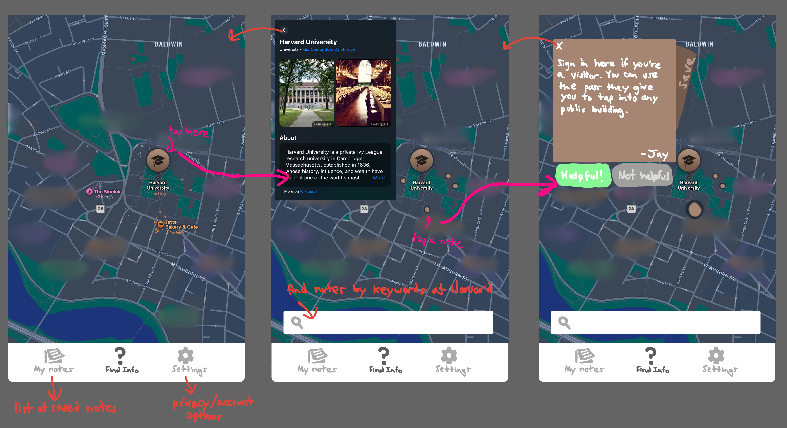

# User journey
Jay (a nervous international student) has recently moved to Canada and wishes to board a train from his local train station to Toronto. Because he is unfamiliar with how fare is processed in Canada, he is worried that he'll run into unexpected fees or cause a commotion at the station by accidentally free-riding (an embarrassing situation that he's found himself in before).

He searches for step-by-step instructions specific to boarding a train in Canada and even [finds a website by the transit company that he's using](https://www.gotransit.com/en/travelling-on-go/boarding-the-go-train), but it is outdated and missing information about his particular station -- where at the station exactly should he scan his ticket, and what are the consequences for forgetting his ticket if that were to occur? He resorts to doing more online searches to no avail: his searches turn up empty and the Google AI summary provides nebulous advice hacked together from various unrelated forum posts. He's left feeling uneasy about what could go wrong in his trip and considers cancelling it altogether.

Finally, he decides to open the Sticky app (screen 1, home page). He scrolls on the map towards his local station and sees that it has a dozen notes from other users. He taps on the station (screen 2), then casually taps on some of the note icons just to become familiar with the station (screen 3). Some of them answer questions that he didn't know he had, such as explaining that the restrooms are in a difficult-to-find spot, or that the trains at this station tend to be later than usual.

To answer his main questions, he types "forgot to pay fare" into the search bar and finds a note explaining that he might be fined if an inspector notices, but that they're uncommon at this station. He rates the note "helpful" and saves it so that he can reassure himself any time he uses this station in the future (screen 3).

He was unfortunately unable to find an answer to his question about where to scan his ticket, but he feels more confident going to the station knowing that the consequences are minimal. Once at the station, he is able to find the ticker scanner, so he opens Sticky again to write a note and attach it to the GPS coordinates of the scanner. Not only will Sticky help him find the scanner in the future, but his public sticky note will help other users that have the same question. 

